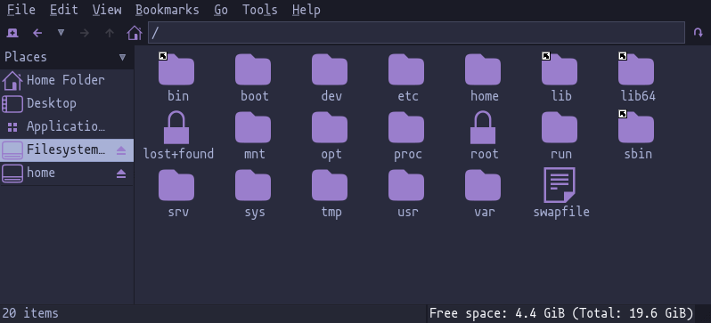

# Tokyonight Theme for GTK

Created with [oomox](https://github.com/themix-project/oomox) and based on the [tokyonight](https://github.com/ghifarit53/tokyonight-vim) vim plugin.

# Requirements

You must have `git` installed to clone the repository, and I recommend installing [lxappearance](https://wiki.lxde.org/en/LXAppearance) when setting and customizing GTK themes.

# Install

1. Clone this repository in your `~/.themes` directory
2. Open `lxappearance` app and set the theme to `tokyonight-gtk`
